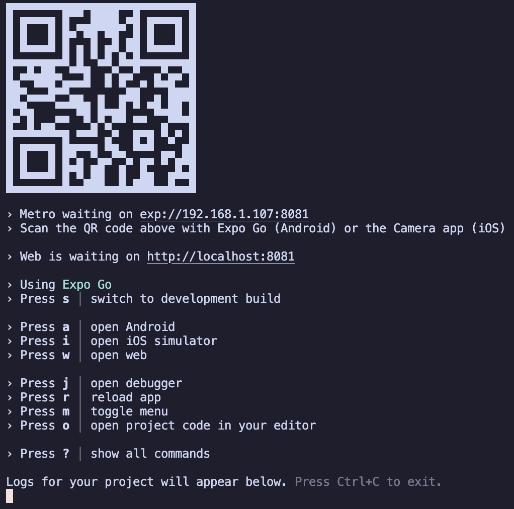
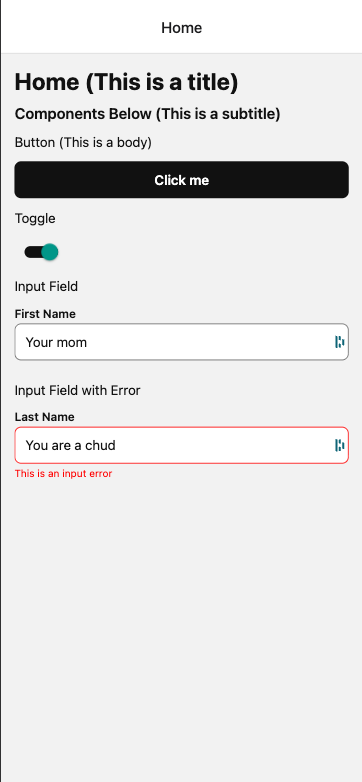
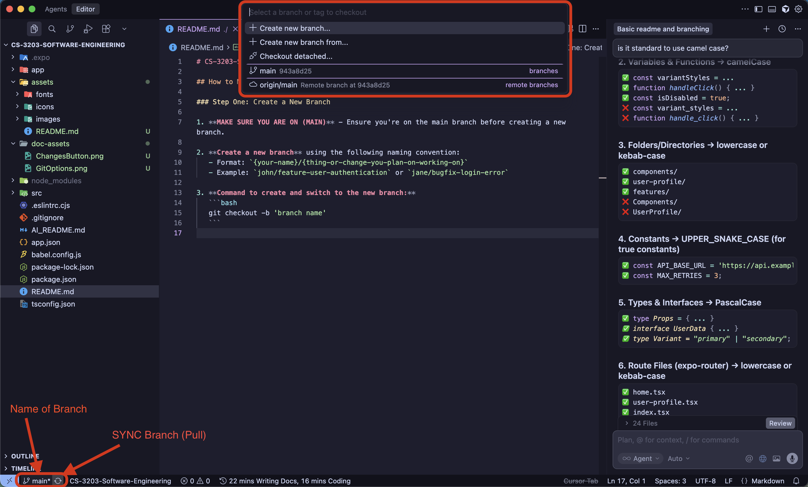
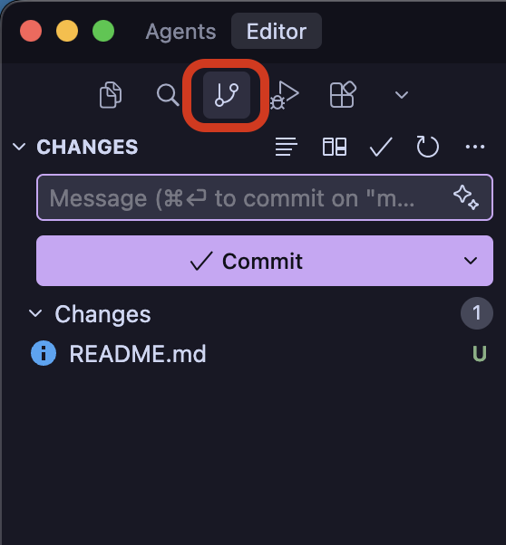

# CS-3203-Software-Engineering

A React Native mobile application built with Expo, TypeScript, and Expo Router. This project follows a feature-based architecture with reusable UI components and smooth animations.

---

## Table of Contents

- [Getting Started](#getting-started)
- [Development Builds](#development-builds)
- [Project Structure](#project-structure)
- [Development Workflow](#development-workflow)
- [Git Workflow](#git-workflow)

---

## Getting Started

### Prerequisites

- **Node.js** (LTS recommended), **npm** or **yarn**, **Git**
- **Mobile testing:** This project uses a development build (not Expo Go). Each developer needs an [Expo account](https://expo.dev/signup) to run builds. For iOS, the team needs one Apple Developer account (add team members or device UDIDs so everyone can install).

### Clone the Repository

**Step 1: Set Up GitHub Credentials (If Needed)**

If you haven't set up GitHub authentication on your laptop:

- Search YouTube for "GitHub SSH setup" or "GitHub authentication setup"
- Use ChatGPT or other resources to guide you through the process
- You'll need to generate SSH keys or set up a personal access token

**Step 2: Clone the Repository**

Clone the repository using either HTTPS or SSH:

**Using HTTPS:**
```bash
git clone https://github.com/hutizaki/CS-3203-Software-Engineering.git
```

**Using SSH:**
```bash
git clone git@github.com:hutizaki/CS-3203-Software-Engineering.git
```

**Step 3: Navigate to Project Directory**

```bash
cd CS-3203-Software-Engineering
```

### Installation

Install all project dependencies:

```bash
npm i
```

### Running the Application

Start the Expo development server:

```bash
npm start
```

A QR code will appear in your terminal, along with several options for viewing your app.

> **Important:** Hot reload is automatically enabled for all platforms. Your changes will appear instantly when you save files (Ctrl + S / Cmd + S).

#### Viewing Options

**Option A: Mobile device (development build)**

This app does not run in Expo Go. Every developer needs the development build app on their phone.

1. **One-time setup (each developer):** In the project root, run `npx eas-cli login` and `npx eas-cli build:configure`. For iOS: one person connects the team’s Apple Developer account in [Expo Dashboard](https://expo.dev) → your project → Credentials; add other devs as team members or register their device UDIDs so they can install.
2. **Get the app on your phone:** Run a build yourself (`npm run build:dev:ios` or `npm run build:dev:android`) and use the install link from the build page, or use an install link a teammate shared. **iOS:** Open the link on your iPhone (your device must be registered or you must be on the Apple team). **Android:** Open the link on your phone, download the APK, allow “Install from unknown sources” if asked, then install.
3. **Daily use:** Run `npm start`, open the **development build app** on your phone (not Expo Go), and scan the QR code.



**Option B: Web browser**

Press `w` in the terminal, then F12 and enable device emulation for hot reload.

**Option C: Emulators**

Press `i` for iOS simulator (macOS) or `a` for Android; requires Xcode or Android Studio.

---

## Development Builds

This project uses **EAS development builds** for iOS and Android; the Expo Go app is not supported. All setup and install steps are in [Getting Started](#getting-started) under **Option A: Mobile device**. Build commands: `npm run build:dev:ios` | `npm run build:dev:android`. For more detail, see [Expo: Development builds](https://docs.expo.dev/develop/development-builds/introduction/).

---

## Project Structure

This project follows a **feature-based architecture** that separates routing from business logic. Understanding this structure is crucial for effective development.

### Architecture Overview

```
app/                    → Routes (thin wrappers, like pages)
src/
  ├── components/ui/    → Reusable UI primitives
  ├── features/         → Feature modules with logic
  ├── theme/           → Design system (colors, spacing)
  ├── lib/             → Utility functions
  └── types/            → TypeScript definitions
```

### Key Concepts

**Routes vs Features**

- **`/app`** contains route files that define navigation and screen structure
- **`/src/features`** contains the actual component logic and business rules
- Routes should be **lean** (10-20 lines), features contain the real work

### Example: Home Screen

The home screen demonstrates this separation:

**Route File: `app/(tabs)/home.tsx`**

This is a thin wrapper that imports and displays a feature:

```tsx
import { Screen } from "@/src/components/ui/Screen";
import { ComponentDemo } from "@/src/features/ComponentDemo";

export default function HomeScreen() {
  return (
    <Screen>
      <ComponentDemo />
    </Screen>
  );
}
```

**Feature Component: `src/features/ComponentDemo.tsx`**

This contains the actual implementation:

```tsx
import { useState } from "react";
import { Button } from "@/src/components/ui/Button";
import { Text } from "@/src/components/ui/Text";
import { Toggle } from "@/src/components/ui/Toggle";
import { Input } from "@/src/components/ui/Input";

export function ComponentDemo() {
  const [toggleValue, setToggleValue] = useState(true);

  return (
    <>
      <Text variant="title">Home (This is a title)</Text>
      <Text variant="subtitle">Components Below (This is a subtitle)</Text>
      <Text variant="body">Button (This is a body)</Text>
      <Button title="Click me" onPress={() => console.log("Button pressed")} />
      <Text variant="body">Toggle</Text>
      <Toggle value={toggleValue} onValueChange={setToggleValue} />
      <Text variant="body">Input Field</Text>
      <Input label="First Name" value="Your mom" onChangeText={(text) => console.log("Input changed", text)} />
      <Text variant="body">Input Field with Error</Text>
      <Input label="Last Name" value="You are a chud" onChangeText={(text) => console.log("Input changed", text)} error="This is an input error" />
    </>
  );
}
```

**Visual Result:**



### Component Organization

- **`/src/components/ui`** - Reusable UI primitives (Button, Input, Text, etc.)
- **`/src/features`** - Feature-specific components and logic
- **`/src/theme`** - Design tokens (colors, spacing) used throughout the app

---

## Development Workflow

### Code Quality Tools

This project includes automated code quality tools:

**Linting:**
```bash
npm run lint
```

**Formatting:**
```bash
npm run format
```

### Best Practices

1. **Keep routes thin** - Routes should only handle navigation structure
2. **Put logic in features** - Business logic belongs in `/src/features`
3. **Use UI components** - Leverage components from `/src/components/ui`
4. **Follow TypeScript** - All files should be properly typed
5. **Run linter** - Fix linting errors before committing

---

## Git Workflow

### Creating a New Branch

**Step 1: Ensure You're on Main**

Always start from the main branch to get the latest changes:

```bash
git checkout main
git pull
```

**Step 2: Create Your Branch**

Use the following naming convention:

```
{your-name}/{feature-or-fix-description}
```

Examples:
- `john/feature-user-authentication`
- `jane/bugfix-login-error`
- `alex/refactor-button-component`

**Step 3: Choose Your Method**

**Method A: Using Git UI (Recommended for Beginners)**

The Git UI provides a visual way to manage branches:

- View your current branch
- Sync with remote (pull latest changes)
- Create new branches from existing ones
- Switch between branches easily



**Method B: Using Command Line**

```bash
git checkout -b 'your-name/feature-description'
```

### Making Changes

**Staging and Committing:**

Use the Changes view to:

- Write descriptive commit messages
- Stage files for commit
- Review changes before committing
- Undo changes if needed



**Best Practices:**

- Write clear, descriptive commit messages
- Commit related changes together
- Review your changes before committing
- Keep commits focused and atomic

### Syncing with Remote

**Git Options Menu:**

Access a comprehensive set of Git operations:

- **Push** - Upload your local commits to the remote repository
- **Pull** - Download and merge remote changes into your local branch
- **Fetch** - Download remote changes without merging
- Additional Git commands and operations


**Workflow:**

1. Create your branch
2. Make your changes
3. Commit your changes with a clear message
4. Push your branch to remote
5. Create a pull request for review
6. **Wait for code review approval** before merging

### Pull Requests and Code Reviews

**Important: Code Review Required**

This repository has branch protection enabled on the `main` branch. **All changes must be reviewed and approved before they can be merged into main.**

**Process:**

1. After pushing your branch, create a Pull Request (PR) on GitHub
2. Request review from at least one team member
3. Address any feedback or requested changes
4. Once approved, your PR can be merged into `main`

**You cannot directly push to `main`** - all changes must go through the pull request and code review process. This ensures code quality and gives team members visibility into changes.

---

## Additional Resources

### Path Aliases

This project uses path aliases for cleaner imports:

- `@/` maps to the project root
- Example: `import { Button } from "@/src/components/ui/Button"`

### Theme System

Colors and spacing are centralized in `/src/theme`:

- `colors.ts` - Color palette
- `spacing.ts` - Spacing scale (xs, sm, md, lg, xl)

### Animation Library

This project uses **React Native Reanimated** for smooth, performant animations:

- Animations run on the native thread
- Components like Button and Toggle include built-in animations
- See component files for animation examples

---

## Getting Help

If you encounter issues:

1. Check the terminal for error messages
2. Ensure all dependencies are installed (`npm i`)
3. Try clearing the cache: `npm start -- --clear`
4. Review the component files in `/src/components/ui` for usage examples
